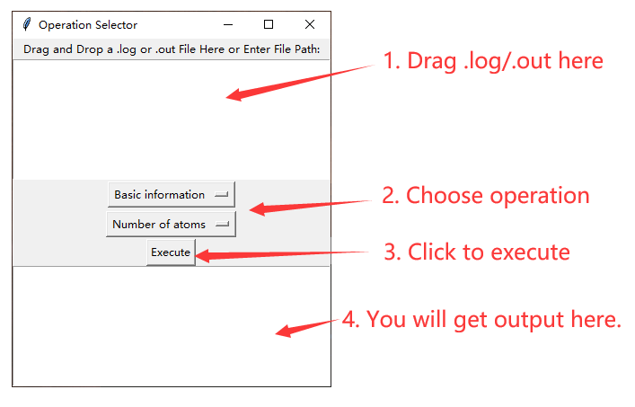
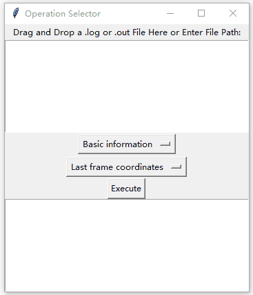

# LogProcessorGUI
Gaussian output file data extraction
# Readme

Log processor GUI processes Gaussian output file (.out or .log).

- Basic information
  - Number of atoms.
  - Log termination type (Normal termination or Gaussian links Error (e.g. l9999), or abnormal termination).
  - Last frame coordinates (Atomic number, and Cartesian coordinate).
- Energy
  - Enthalpy (when use keyword `Freq`), in a.u.
  - Enthalpy correction (when use keyword `Freq`), in a.u.
  - Single point energy (all frames in output), in a.u.
- Spectra
  - Frequency, in $\text{cm}^{-1}$
  - IR intensity 
  - Raman activity
  - Force constant
  - Reduced mass
  - NMR shielding (when use keyword `NMR`): SCF GIAO Magnetic shielding tensor (ppm), Isotropic.

---

Environment requirements:

```
conda install numpy pandas tk tkinterdnd2
```

After installation, execute:

```
python log_processor_gui.py
```

Will give this window:



Example: Show all single point energies in log file.


